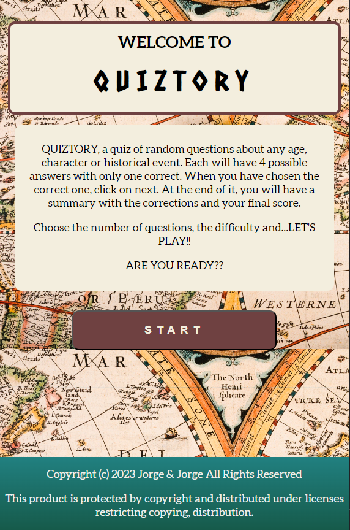
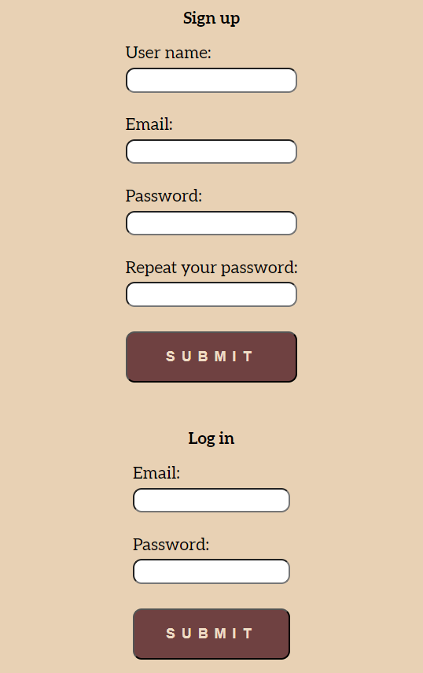

# Quiz_2.0
JorgeMonterde.github.io

## QUIZTORY ##

Este repositorio contiene un quiz interactivo sobre historia que te permite poner a prueba tus conocimientos históricos. El objetivo del proyecto es proporcionar una experiencia divertida para aprender sobre diversos eventos históricos.

## Estructura del Quiz

El quiz consta de tres documentos HTML principales:

1. **home.html**: Este documento actúa como la página de inicio del juego. Aquí, los usuarios son recibidos con una introducción al juego y se les proporciona información sobre cómo funciona y se detallan las reglas.

2. **questions.html**: Esta página es el corazón del juego. Aquí, los usuarios pueden registrarse o iniciar sesión utilizando un panel de sign up y log in. La información del usuario se contrasta y autentifica utilizando Firebase Fireauth, lo que garantiza un proceso seguro de registro e inicio de sesión. Una vez que los usuarios han iniciado sesión, se les presenta una selección de dos niveles de dificultad para las preguntas: fácil y difícil. Esta elección permite adaptar el juego a diferentes niveles de conocimiento y habilidades. Además, los usuarios pueden seleccionar el número de preguntas que desean responder, lo que les brinda un mayor control sobre la duración y la profundidad del juego.

   Para generar las preguntas, se utilizan dos endpoints diferentes generados en https://opentdb.com/api_config.php. Esta API proporciona una amplia gama de preguntas históricas clasificadas por dificultad. El juego utiliza la información proporcionada por el usuario (nivel de dificultad y número de preguntas) para realizar solicitudes a la API correspondiente y obtener las preguntas adecuadas para el juego.

   

   Cada pregunta se genera de manera aleatoria recogida desde la API. Una vez que se generan las preguntas, se presentan una por una al usuario. Cada pregunta tiene 4 opciones de respuesta, cuyo orden también será aleatorio cada vez, y el usuario debe seleccionar una de ellas. Para cada respuesta seleccionada, se almacena la opción elegida en una base de datos de Firebase Firestore. Esto permite realizar un seguimiento de las respuestas del usuario y evaluar su desempeño al final del juego.

   Una vez respondidas todas las preguntas, se obtendrán desde la base de datos para mostrarlas de nuevo ya corregidas y con la puntuación obtenida por el usuario. Introducimos en este punto una animación de acordeón a través del CSS con la que el usuario podrá consultar el resultado de cada una de sus respuestas.

3. **results.html**: Esta página muestra al usuario una gráfica con los resultados históricos de partidas anteriores. Los datos utilizados para generar la gráfica se obtienen de la base de datos de Firebase Firestore, donde se almacenan las respuestas y los resultados de las partidas anteriores. Utilizando JavaScript y las funciones proporcionadas por la librería Chartist.js, se representa visualmente la evolución de las puntuaciones a lo largo del tiempo. Esta sección proporciona una perspectiva histórica de los resultados del juego y permite a los usuarios comparar su desempeño con el de otros jugadores.

## Estructura de los archivos

El repositorio está estructurado de la siguiente manera:

- **home.html**: Página de inicio del juego que proporciona una introducción y una visión general del juego.
- **questions.html**: Página principal del juego, donde se autentifica el usuario, se generan las preguntas y se almacenan las respuestas de los usuarios.
- **results.html**: Página de resultados con la gráfica de puntuaciones históricas de partidas anteriores realizadas por el usuario. Maneja la conexión con Firebase para la autenticación de usuarios y el almacenamiento de datos en Firestore.
- **scripts.js**: Archivo JavaScript que contiene la lógica del juego, incluyendo el acceso a los endpoints, la generación de preguntas, el almacenamiento de respuestas y la manipulación de datos.
- **styles.css**: Archivo CSS que contiene los estilos para las diferentes páginas, brindando una apariencia visualmente atractiva y coherente.

## Bugs
Hemos detectado varios bugs en el código que no son difíciles de solucionar pero que requieren más tiempo para pulirlos del que tenemos. Algunos de ellos son:
- Al ser en inglés, algunas respuestas tienen apóstrofe (') y no reconoce cuando se hace click en ellas.
- En el gráfico, las fechas y horas obtenidas eliminan algunos ceros a la izquierda.
- La última pregunta permite no contestarla y pasar a los resultados.

## Configuración y requisitos

Para ejecutar el juego correctamente, se deben seguir los siguientes pasos:

1. Configuración de Firebase: Se requiere tener una cuenta en Firebase y configurar un proyecto. Se deben proporcionar las credenciales de Firebase en el archivo `scripts.js` para permitir la autenticación de usuarios y el almacenamiento de datos en Firestore.

2. Acceso a internet: El juego hace uso de APIs externas para obtener las preguntas históricas. Por lo tanto, se necesita una conexión a internet estable para obtener las preguntas y mostrarlas a los usuarios.

## Contribuciones

Las contribuciones son bienvenidas. Si tienes ideas para mejorar el juego, corregir errores o agregar nuevas características, no dudes en crear un pull request en este repositorio. Se valorará cualquier contribución que pueda enriquecer la experiencia del usuario y la calidad del juego.